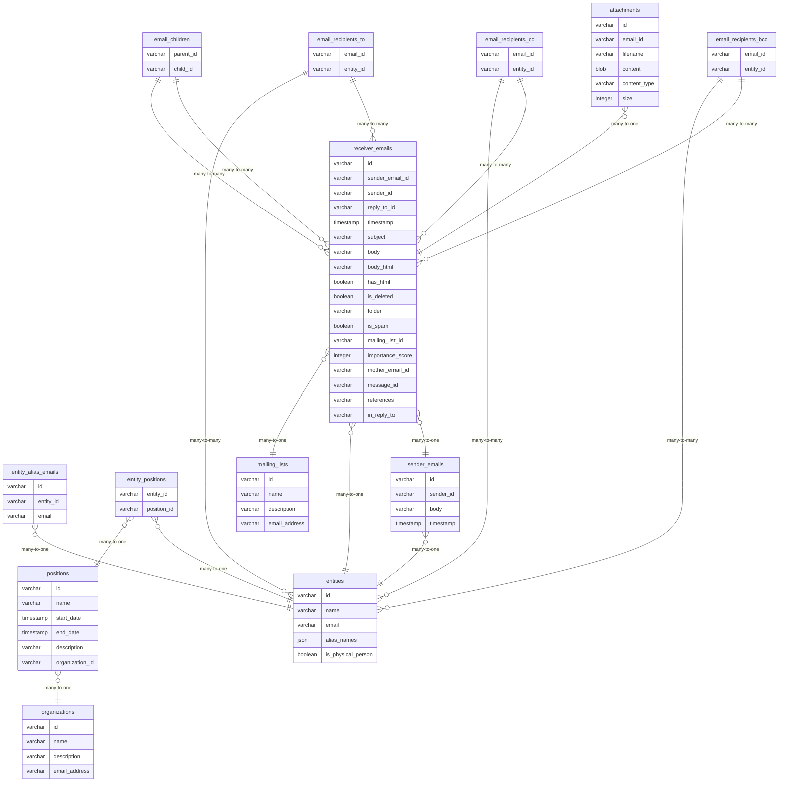

```mermaid
erDiagram
    attachments {
        varchar id
        varchar email_id
        varchar filename
        blob content
        varchar content_type
        integer size
    }
    email_children {
        varchar parent_id
        varchar child_id
    }
    email_recipients_bcc {
        varchar email_id
        varchar entity_id
    }
    email_recipients_cc {
        varchar email_id
        varchar entity_id
    }
    email_recipients_to {
        varchar email_id
        varchar entity_id
    }
    entities {
        varchar id
        varchar name
        varchar email
        json alias_names
        boolean is_physical_person
    }
    entity_alias_emails {
        varchar id
        varchar entity_id
        varchar email
    }
    entity_positions {
        varchar entity_id
        varchar position_id
    }
    mailing_lists {
        varchar id
        varchar name
        varchar description
        varchar email_address
    }
    organizations {
        varchar id
        varchar name
        varchar description
        varchar email_address
    }
    positions {
        varchar id
        varchar name
        timestamp start_date
        timestamp end_date
        varchar description
        varchar organization_id
    }
    receiver_emails {
        varchar id
        varchar sender_email_id
        varchar sender_id
        varchar reply_to_id
        timestamp timestamp
        varchar subject
        varchar body
        varchar body_html
        boolean has_html
        boolean is_deleted
        varchar folder
        boolean is_spam
        varchar mailing_list_id
        integer importance_score
        varchar mother_email_id
        varchar message_id
        varchar references
        varchar in_reply_to
    }
    sender_emails {
        varchar id
        varchar sender_id
        varchar body
        timestamp timestamp
    }
    attachments }o--|| receiver_emails : "many-to-one"
    email_recipients_bcc ||--o{ receiver_emails : "many-to-many"
    email_recipients_bcc ||--o{ entities : "many-to-many"
    email_recipients_cc ||--o{ receiver_emails : "many-to-many"
    email_recipients_cc ||--o{ entities : "many-to-many"
    email_recipients_to ||--o{ receiver_emails : "many-to-many"
    email_recipients_to ||--o{ entities : "many-to-many"
    entity_alias_emails }o--|| entities : "many-to-one"
    entity_positions }o--|| entities : "many-to-one"
    entity_positions }o--|| positions : "many-to-one"
    positions }o--|| organizations : "many-to-one"
    receiver_emails }o--|| sender_emails : "many-to-one"
    receiver_emails }o--|| entities : "many-to-one"
    receiver_emails }o--|| mailing_lists : "many-to-one"
    sender_emails }o--|| entities : "many-to-one"
    email_children ||--o{ receiver_emails : "many-to-many"
    email_children ||--o{ receiver_emails : "many-to-many"
```