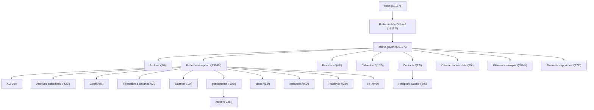

# Folder Structure Visualization

```mermaid
flowchart TD
    node_root["Root (19137)"]
    node_Boite_mail_de_Celine["Boîte mail de Céline \(19137\)"]
    node_root --> node_Boite_mail_de_Celine
    node_Boite_mail_de_Celine_celine_guyon["celine.guyon \(19137\)"]
    node_Boite_mail_de_Celine --> node_Boite_mail_de_Celine_celine_guyon
    node_Boite_mail_de_Celine_celine_guyon_Archive["Archive \(10\)"]
    node_Boite_mail_de_Celine_celine_guyon --> node_Boite_mail_de_Celine_celine_guyon_Archive
    node_Boite_mail_de_Celine_celine_guyon_Boite_de_reception["Boîte de réception \(13205\)"]
    node_Boite_mail_de_Celine_celine_guyon --> node_Boite_mail_de_Celine_celine_guyon_Boite_de_reception
    node_Boite_mail_de_Celine_celine_guyon_Brouillons["Brouillons \(41\)"]
    node_Boite_mail_de_Celine_celine_guyon --> node_Boite_mail_de_Celine_celine_guyon_Brouillons
    node_Boite_mail_de_Celine_celine_guyon_Calendrier["Calendrier \(107\)"]
    node_Boite_mail_de_Celine_celine_guyon --> node_Boite_mail_de_Celine_celine_guyon_Calendrier
    node_Boite_mail_de_Celine_celine_guyon_Contacts["Contacts \(12\)"]
    node_Boite_mail_de_Celine_celine_guyon --> node_Boite_mail_de_Celine_celine_guyon_Contacts
    node_Boite_mail_de_Celine_celine_guyon_Courrier_indesirable["Courrier indésirable \(45\)"]
    node_Boite_mail_de_Celine_celine_guyon --> node_Boite_mail_de_Celine_celine_guyon_Courrier_indesirable
    node_Boite_mail_de_Celine_celine_guyon_Élements_envoyes["Éléments envoyés \(5559\)"]
    node_Boite_mail_de_Celine_celine_guyon --> node_Boite_mail_de_Celine_celine_guyon_Élements_envoyes
    node_Boite_mail_de_Celine_celine_guyon_Élements_supprimes["Éléments supprimés \(277\)"]
    node_Boite_mail_de_Celine_celine_guyon --> node_Boite_mail_de_Celine_celine_guyon_Élements_supprimes
    node_Boite_mail_de_Celine_celine_guyon_Boite_de_reception_AG["AG \(6\)"]
    node_Boite_mail_de_Celine_celine_guyon_Boite_de_reception --> node_Boite_mail_de_Celine_celine_guyon_Boite_de_reception_AG
    node_Boite_mail_de_Celine_celine_guyon_Boite_de_reception_Archives_calssifiees["Archives calssifiees \(423\)"]
    node_Boite_mail_de_Celine_celine_guyon_Boite_de_reception --> node_Boite_mail_de_Celine_celine_guyon_Boite_de_reception_Archives_calssifiees
    node_Boite_mail_de_Celine_celine_guyon_Boite_de_reception_Conflit["Conflit \(6\)"]
    node_Boite_mail_de_Celine_celine_guyon_Boite_de_reception --> node_Boite_mail_de_Celine_celine_guyon_Boite_de_reception_Conflit
    node_Boite_mail_de_Celine_celine_guyon_Boite_de_reception_Formation_à_distance["Formation à distance \(2\)"]
    node_Boite_mail_de_Celine_celine_guyon_Boite_de_reception --> node_Boite_mail_de_Celine_celine_guyon_Boite_de_reception_Formation_à_distance
    node_Boite_mail_de_Celine_celine_guyon_Boite_de_reception_Gazette["Gazette \(10\)"]
    node_Boite_mail_de_Celine_celine_guyon_Boite_de_reception --> node_Boite_mail_de_Celine_celine_guyon_Boite_de_reception_Gazette
    node_Boite_mail_de_Celine_celine_guyon_Boite_de_reception_gestioncrise["gestioncrise \(103\)"]
    node_Boite_mail_de_Celine_celine_guyon_Boite_de_reception --> node_Boite_mail_de_Celine_celine_guyon_Boite_de_reception_gestioncrise
    node_Boite_mail_de_Celine_celine_guyon_Boite_de_reception_Idees["Idees \(18\)"]
    node_Boite_mail_de_Celine_celine_guyon_Boite_de_reception --> node_Boite_mail_de_Celine_celine_guyon_Boite_de_reception_Idees
    node_Boite_mail_de_Celine_celine_guyon_Boite_de_reception_Instances["Instances \(60\)"]
    node_Boite_mail_de_Celine_celine_guyon_Boite_de_reception --> node_Boite_mail_de_Celine_celine_guyon_Boite_de_reception_Instances
    node_Boite_mail_de_Celine_celine_guyon_Boite_de_reception_Plaidoyer["Plaidoyer \(38\)"]
    node_Boite_mail_de_Celine_celine_guyon_Boite_de_reception --> node_Boite_mail_de_Celine_celine_guyon_Boite_de_reception_Plaidoyer
    node_Boite_mail_de_Celine_celine_guyon_Boite_de_reception_RH["RH \(40\)"]
    node_Boite_mail_de_Celine_celine_guyon_Boite_de_reception --> node_Boite_mail_de_Celine_celine_guyon_Boite_de_reception_RH
    node_Boite_mail_de_Celine_celine_guyon_Contacts_Recipient_Cache["Recipient Cache \(69\)"]
    node_Boite_mail_de_Celine_celine_guyon_Contacts --> node_Boite_mail_de_Celine_celine_guyon_Contacts_Recipient_Cache
    node_Boite_mail_de_Celine_celine_guyon_Boite_de_reception_gestioncrise_Ateliers["Ateliers \(28\)"]
    node_Boite_mail_de_Celine_celine_guyon_Boite_de_reception_gestioncrise --> node_Boite_mail_de_Celine_celine_guyon_Boite_de_reception_gestioncrise_Ateliers
```
